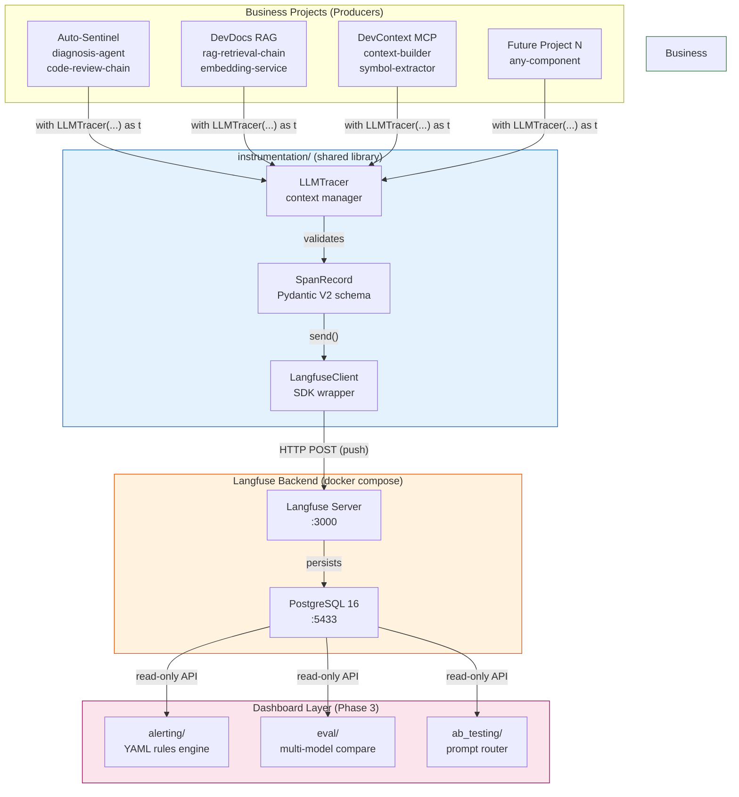
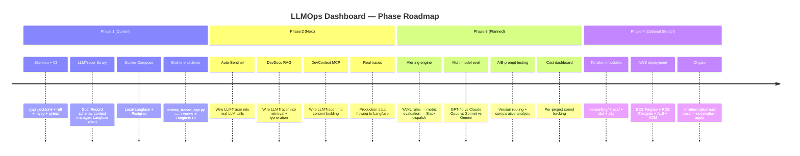
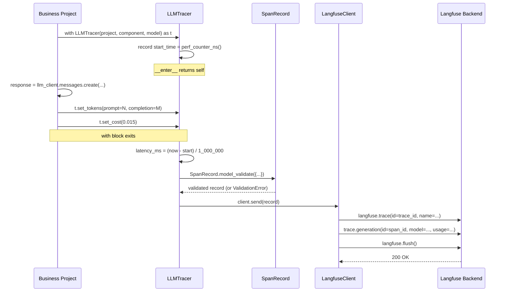
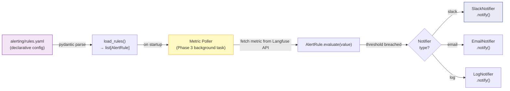

# Architecture

## Diagram 1: Push-Based Trace Flow

**Key constraint**: The arrows from Business Projects flow only INTO the library and backend.
Dashboard reads Langfuse read-only. Business projects are NEVER called by the dashboard.

---

## Diagram 2: Phase Evolution Roadmap

---

## Diagram 3: LLMTracer Internal Flow

---

## Diagram 4: Alert Rule Lifecycle (Phase 3)

Phase 1 implements: YAML → PARSE (schema only). POLL → EVAL → NOTIF is Phase 3.
